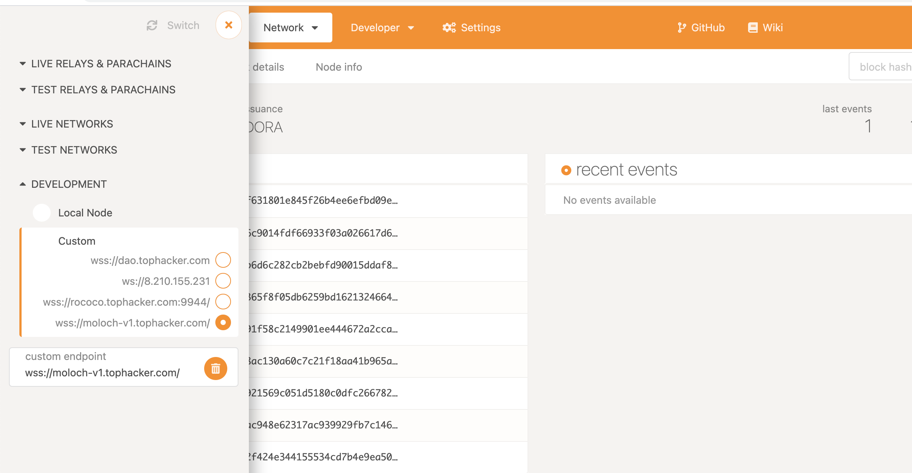

### Build
Run `cargo +nightly build --release`  
Then run `./target/release/node-template --dev`

### Test
1. Navigate to https://polkadot.js.org/apps/#/explorer, and  copy the exmaple to settings->developer
2. Click the lef top icon to open settings and choose the local node, just like below

---
summon, use one account to set up initial config for moloch
submit_proposal, propose one member, define the shares and tribute
submit_vote, only member can vote a YES/NO to a propsoal which is valid
process_proposal, anyone can process a proposal, after passed, the applicant will become a member, no matter pass or not
the processor will get reward, which is a global constant
---
abort, the proposer can abort a proposal
ragequite, the member can rage quite
