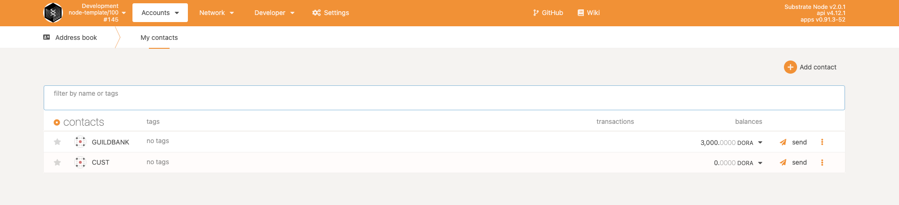

### Build
Run `cargo +nightly build --release`  
Then run `./target/release/node-template --dev`

### Test
1. Navigate to https://polkadot.js.org/apps/#/explorer, and  copy the [types.json](../pallets/moloch-v1/src/types.json) to settings->developer then save

2. Click the lef top icon to open settings and choose the local node, just like below

3. `summon`, this is to set up initial configuration for your moloch DAO.  
- period_duration, timing unit in seconds, for test you can set it to 120.  
- voting_period_length, number of periods for voting, after that you can not vote anymore.  
- grace_period_length, number of periods for silencing next behind voting, in case any member `ragequit`.  
- abort_window, number of periods to abort, after this window, no permission to abort.  
- proposal_deposit, tokens to deposit when member proposed a proposal.
- proposal_reward, tokens will be distribute to anyone processed a proposal, this will be deducted from proposer's deposit, so it's NOT greater than proposal_deposit

4. `custody`, applicants tansfer token_tribute to custody account. The applicant can not get proposed until finishing this.
- token_tribute, number of tokens to request shares in the future, DO NOT tansfer less/more.  
Below is an example shows that we tribute 2000 DORA

After submit transactions, you can navigate to Network->Explorer to see the events, you can copy the custody account and save it in your address book so that you can view balances.


5. `submit_proposal`, propose one member, define the shares and tribute. Make sure the applicant desopsit corresponding token to our custody account.
- token_tribute, number of token desposit in custody account, which will be transfered into guildbank if proposal gets passed.
- shared_requests, shares to be mint.

6. `submit_vote`, only member can vote a YES/NO to a propsoal which is valid.
- proposal_index, the index of proposal queque
- vote, 1/2 means YES/NO, other inputs are not valid  
After proposal submitted, you can use member to vote. As long as it's still in voting period.

You can check that proposals have been update.

6. `process_proposal`, anyone can process a proposal, after passing grace period. No matter the proprosal passed or not the processor will get reward, which is a global constant.
- proposal_index, the index of proposal queque

After processing, Bob will become a member and Bob_Stash's balance increased 500 `DORA` which is just the amount of processing_reward.


7. `abort`, the applicant can abort a proposal which is still in abort window.
- proposal_index, the index of proposal queque
We can use another account to custody some tokens and then ask member to propose. But this time, after submitted, we use this applicant to abort. In this way, we'll see applicant's balance remain the same, but member's deposit will NOT be returned.


```NOTE: Aborted proposal also need to be processed``` 

8. `ragequit`, the member can rage quit. This will burn some shares and return some token to the member.
- shares_to_burn, the shares need to be burnt.
Let's use Bob the burn 5 shares, thus remaining tokens in guildbank should be `(1+(10-5))/11 * 3000=1636.3636`. 
